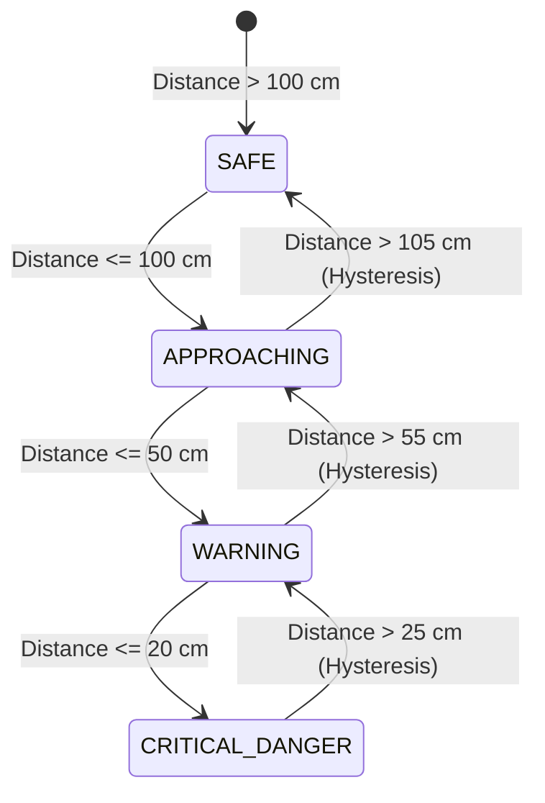
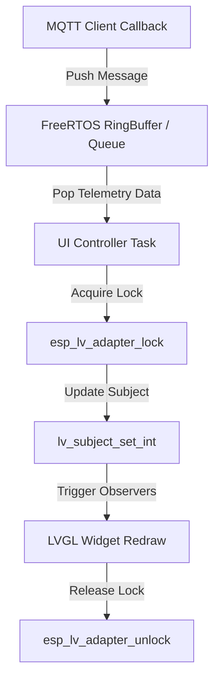

# LVGL v9 Warning Display & Architectural Pipeline Skill

This skill provides a comprehensive design framework, architectural patterns, memory budgets, reactive data pipelines, and developer SOP for building high-performance, real-time vehicle warning displays using **LVGL v9** on **ESP32-S3** microcontrollers with 7-inch RGB Touch LCD panels (800x480 resolution).

---

## Skill Capabilities & Core Guidelines

### 1. Design System & HSL Theme Tokens
Enforce a modern dark-mode canvas paired with clear visual alert state tokens:

| Token Name | Hex Code | HSL Color | Visual State | Trigger Condition |
| :--- | :--- | :--- | :--- | :--- |
| `COLOR_BG_DARK` | `#0F172A` | H:222, S:47%, L:11% | Slate Dark Background | Base Layout Canvas |
| `COLOR_SURFACE` | `#1E293B` | H:215, S:28%, L:17% | Card / Container Surface | Widget Panels & Tabs |
| `COLOR_SAFE` | `#10B981` | H:160, S:84%, L:39% | Emerald Green | Distance > 100 cm |
| `COLOR_APPROACHING` | `#F59E0B` | H:38, S:92%, L:50% | Amber Yellow | 50 cm < Distance ≤ 100 cm |
| `COLOR_WARNING` | `#F97316` | H:24, S:95%, L:53% | Vivid Orange | 20 cm < Distance ≤ 50 cm |
| `COLOR_CRITICAL` | `#EF4444` | H:0, S:84%, L:60% | Flash Crimson Red | Distance ≤ 20 cm |

---

### 2. 4-Level Warning State Machine & 5cm Hysteresis

To eliminate rapid toggle flickering (chatter) near threshold boundaries, enforce a 5cm hysteresis offset on state exit transitions:

| Warning State | Threshold Range | Color Token | UI Animation & Overlay | Audio Alert Behavior |
| :--- | :--- | :--- | :--- | :--- |
| **`SAFE`** | > 100 cm | `COLOR_SAFE` | Static arc gauge, neutral status badge | Mute |
| **`APPROACHING`** | 50 cm - 100 cm | `COLOR_APPROACHING` | Yellow arc glow, 1Hz status pulse | Mute |
| **`WARNING`** | 20 cm - 50 cm | `COLOR_WARNING` | Orange warning banner slide-in | 2Hz Beep Tone |
| **`CRITICAL_DANGER`** | ≤ 20 cm | `COLOR_CRITICAL` | Flashing full-screen red overlay (5Hz) | Continuous Rapid Beep |

---

### 3. Modular 3-Tab Architecture

Partition UI responsibilities into 3 distinct functional tabs using `lv_tabview`:

1. **Tab 1 - Live Warning**:
   - Central dynamic distance gauge (`lv_arc` + `lv_scale`).
   - Pill-shaped state status badge.
   - Animated warning banner overlay (`lv_anim_t`).
2. **Tab 2 - Telemetry History**:
   - Real-time chart (`lv_chart`) showing rolling distance samples with threshold marker lines.
3. **Tab 3 - System Config**:
   - Interactive sliders (`lv_slider`) for threshold tuning, sound toggle switch (`lv_switch`), and sensor zero-point calibration trigger.

---

### 4. Thread-Safe Reactive Pipeline

- **Thread Isolation**: Never execute LVGL API calls directly inside `esp_mqtt` callbacks. Pass telemetry into a FreeRTOS Queue, then consume inside the UI controller under `esp_lv_adapter_lock()`.
- **I2C Bus Lock**: Protect shared I2C peripherals (GT911 touch controller and CH422G IO expander) using a dedicated I2C bus mutex (`xI2C_Mutex`).

---

### 5. Memory & PSRAM Optimization

- **PSRAM Dual Framebuffers**: Allocate 2 full framebuffers in PSRAM (`.fb_in_psram = 1`) for 800x480 RGB565 display (~1.5 MB total).
- **Internal SRAM Bounce Buffer**: Allocate a 40-line internal SRAM bounce buffer (`bounce_buffer_size_px = 800 * 40`) to prevent PSRAM bus starvation and LCD flickering during simultaneous Wi-Fi/MQTT activities.

---

## Bundled References & Deep-Dive Guides

For detailed architectural analysis, hardware audits, and code examples, consult the files in `references/`:

- **[`references/ui_development_pipeline.md`](file:///e:/supersonic-sensor-ACLAB/.agents/skills/lvgl_v9_warning_display/references/ui_development_pipeline.md)**: Master UI Development Pipeline & SOP document.
- **[`references/warning_system_pipeline.md`](file:///e:/supersonic-sensor-ACLAB/.agents/skills/lvgl_v9_warning_display/references/warning_system_pipeline.md)**: End-to-end telemetry pipeline, state machine, and hardware driver setup sequence.
- **[`references/lvgl_demos_architecture_review.md`](file:///e:/supersonic-sensor-ACLAB/.agents/skills/lvgl_v9_warning_display/references/lvgl_demos_architecture_review.md)**: Audit of LVGL v9 standard demos (`widgets`, `music`, `benchmark`, `stress`).
- **[`references/waveshare_hardware_examples_review.md`](file:///e:/supersonic-sensor-ACLAB/.agents/skills/lvgl_v9_warning_display/references/waveshare_hardware_examples_review.md)**: Audit of manufacturer hardware peripheral examples (I2C, RS485, SD, ADC, UART, CAN/TWAI, LVGL v8/v9).
