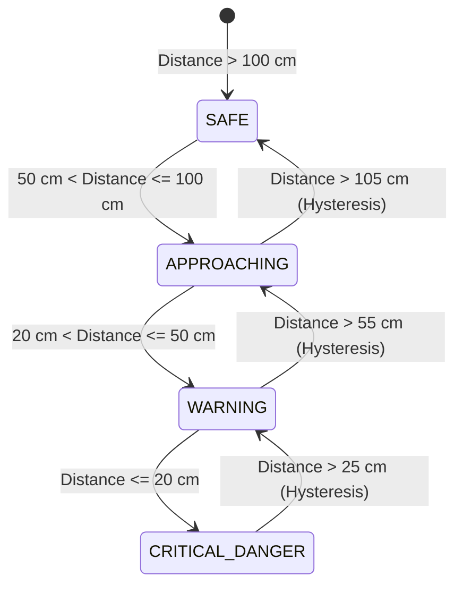

# LVGL v9 Warning Display & Architectural Pipeline Skill

This skill provides a comprehensive design framework, architectural patterns, and execution pipeline for building high-performance, real-time warning displays using **LVGL v9** on **ESP32-S3** microcontrollers with RGB touch LCDs (such as the Waveshare 7-inch 800x480 panel).

---

## Skill Capabilities & Best Practices

1. **Reactive UI State Management**:
   - Utilize LVGL v9 `lv_subject_t` and `lv_observer_t` to bind incoming MQTT/sensor telemetry directly to UI labels, dynamic arc gauges, and color themes without manual widget tree parsing.

2. **High-Frequency Custom Drawing**:
   - Implement custom draw callbacks registered on `LV_EVENT_DRAW_MAIN_BEGIN` combined with integer trigonometric lookup tables (`sin`/`cos`) for real-time spectrum and wave warning animations without floating-point CPU stalls.

3. **Thread-Safe Data Pipeline**:
   - Enforce strict thread isolation between `esp_mqtt` event callbacks, FreeRTOS background tasks, and the LVGL adapter loop using `esp_lv_adapter_lock()` / `esp_lv_adapter_unlock()`.
   - Protect shared I2C bus peripherals (GT911 touch controller and CH422G IO expander) using a dedicated I2C bus mutex.

4. **PSRAM & SRAM Memory Management**:
   - Allocate dual RGB565 framebuffers in PSRAM (`.fb_in_psram = 1`).
   - Configure internal SRAM DMA bounce buffers (`bounce_buffer_size_px = 800 * 40`) to prevent PSRAM bus starvation and LCD flickering during simultaneous Wi-Fi/MQTT activities.

---

## 4-Level Warning State Machine Rule

When implementing vehicle/proximity warning displays, enforce the following 4-level state machine with a 5cm hysteresis buffer:

| Warning State | Threshold Range | Theme / Color Token | UI Overlay & Sound Behavior |
| :--- | :--- | :--- | :--- |
| **`STATE_SAFE`** | > 100 cm | Emerald Green (`#10B981`) | Dark neutral background, static gauge, no audio. |
| **`STATE_APPROACHING`** | 50 cm - 100 cm | Amber Yellow (`#F59E0B`) | Yellow arc highlight, 1Hz status badge pulse. |
| **`STATE_WARNING`** | 20 cm - 50 cm | Vivid Orange (`#F97316`) | Warning banner active, 2Hz audio beep tone. |
| **`STATE_CRITICAL_DANGER`** | ≤ 20 cm | Flash Crimson Red (`#EF4444`) | Flashing full-screen overlay (5Hz), rapid continuous buzzer, alert popup. |

---

## Modular UI Hierarchy (3-Tab Architecture)

Use `lv_tabview` to partition display responsibility into 3 distinct functional tabs (inspired by `lv_demo_widgets`):

1. **Tab 1 - Live Warning**:
   - Central dynamic distance gauge (`lv_arc` + `lv_scale`).
   - Pill-shaped state status badge.
   - Animated warning banner overlay (`lv_anim_t`).
2. **Tab 2 - Telemetry History**:
   - Real-time line chart (`lv_chart`) showing rolling distance samples with warning threshold marker lines.
3. **Tab 3 - System Config**:
   - Interactive sliders (`lv_slider`) for threshold tuning, sound toggle (`lv_switch`), and sensor calibration controls.

---

## References & Deep-Dive Technical Documentation

For complete source code analysis, memory benchmarks, and step-by-step hardware driver setup, refer to the bundled skill reference documents:

- **[`references/lvgl_demos_architecture_review.md`](file:///e:/supersonic-sensor-ACLAB/.agents/skills/lvgl_v9_warning_display/references/lvgl_demos_architecture_review.md)**: Full audit of `lv_demo_widgets`, `lv_demo_music`, `lv_demo_benchmark`, and `lv_demo_stress`.
- **[`references/warning_system_pipeline.md`](file:///e:/supersonic-sensor-ACLAB/.agents/skills/lvgl_v9_warning_display/references/warning_system_pipeline.md)**: End-to-end data flow pipeline, thread locking rules, state machine matrix, and hardware driver initialization sequence.
