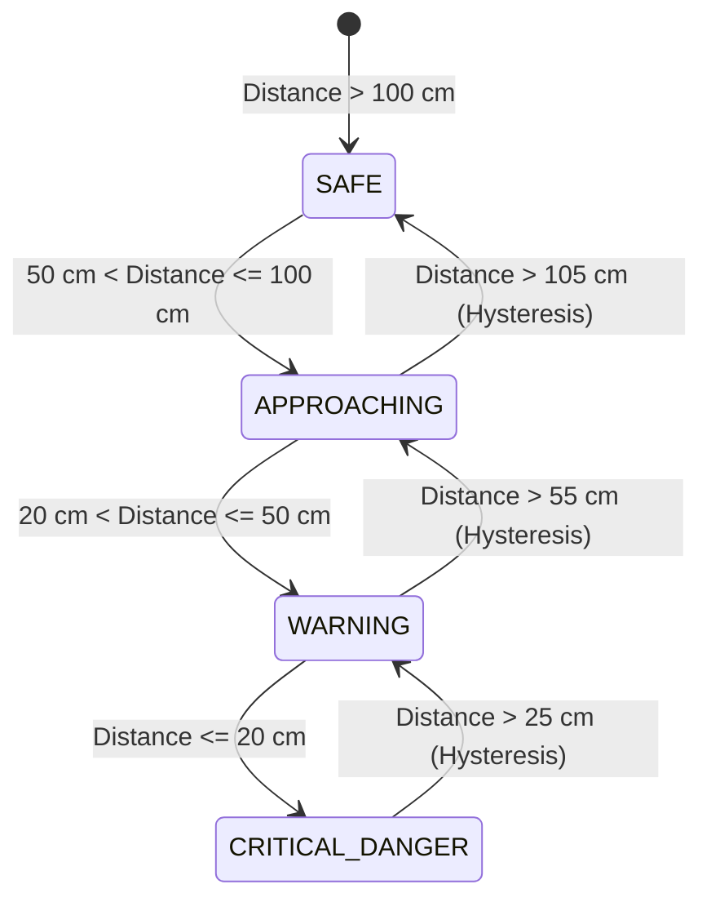

# Vehicle Warning Display System Pipeline & State Machine Reference

> **Reference File**: End-to-end operational pipeline, state machine, and hardware interaction guide for ESP32-S3 Vehicle Warning Systems.

---

## 1. End-to-End Data & Threading Pipeline

```mermaid
flowchart LR
    subgraph Sensor Node ["Sensor Node (JSN-SR04T)"]
        A["Ultrasonic Sensor"] --> B["ESP32-S3 Distance Task"]
        B --> C["MQTT Telemetry (v1/devices/me/telemetry)"]
    end

    subgraph CoreIoT ["CoreIoT Cloud"]
        C --> D["Rule-Chain Processing"]
        D --> E["Publish Telemetry & State"]
    end

    subgraph Display Node ["Waveshare Screen Node (ESP32-S3)"]
        E --> F["ESP-MQTT Event Task"]
        F --> G["FreeRTOS Telemetry Queue"]
        G --> H["UI Task (esp_lv_adapter_lock)"]
        H --> I["Update LVGL Subjects"]
        I --> J["Render Dynamic Observers"]
    end
```

### Thread Safety Guidelines
1. **MQTT Context Protection**: Never call LVGL APIs (`lv_label_set_text`, `lv_arc_set_value`) inside the `esp_mqtt` event handler callback. Pass telemetry data into a FreeRTOS Queue (`telemetry_queue`), then consume it inside the UI Controller task under `esp_lv_adapter_lock(-1)`.
2. **I2C Bus Lock**: The GT911 Touch IC and CH422G Expander share `I2C_NUM_0`. Wrap all GT911 touch operations and CH422G IO writes in an I2C bus mutex (`i2c_bus_lock`).

---

## 2. 4-Level Warning State Machine Matrix

| State Name | Distance Threshold | Color Token | Visual & Sound Output |
| :--- | :--- | :--- | :--- |
| **`STATE_SAFE`** | > 100 cm | Emerald Green (`#10B981`) | Dark neutral background, static distance display, no audio. |
| **`STATE_APPROACHING`** | 50 cm - 100 cm | Amber Yellow (`#F59E0B`) | Yellow gauge highlight, 1Hz status badge pulse, info message. |
| **`STATE_WARNING`** | 20 cm - 50 cm | Vivid Orange (`#F97316`) | Orange warning banner, medium 2Hz audio beep, dynamic chart alert. |
| **`STATE_CRITICAL_DANGER`** | ≤ 20 cm | Flash Crimson Red (`#EF4444`) | Flashing full-screen overlay (5Hz), rapid continuous buzzer tone, danger popup. |

> [!IMPORTANT]
> **Hysteresis Buffer**: Maintain a 5 cm hysteresis offset on exit transitions (e.g., transition from `CRITICAL_DANGER` back to `WARNING` requires distance > 25 cm) to eliminate state chattering caused by sensor noise.

---

## 3. Hardware Driver Initialization Sequence

1. **Power & Hardware Reset**:
   - Write `0x1E` to CH422G register `0x38` to turn ON the LCD Backlight.
   - Send pulse sequence (`0x2C` $\rightarrow$ `0x2E` to `0x38`) to reset the GT911 Touch IC.
2. **RGB Panel & PSRAM Allocation**:
   - Initialize `esp_lcd_rgb_panel` with `.fb_in_psram = 1`.
   - Set `bounce_buffer_size_px = 800 * 40`.
3. **LVGL Adapter Setup**:
   - Initialize `esp_lv_adapter` with `task_stack_size = 12 * 1024` and `stack_in_psram = true`.
   - Register display driver and touch driver.
   - Call `esp_lv_adapter_start()`.
