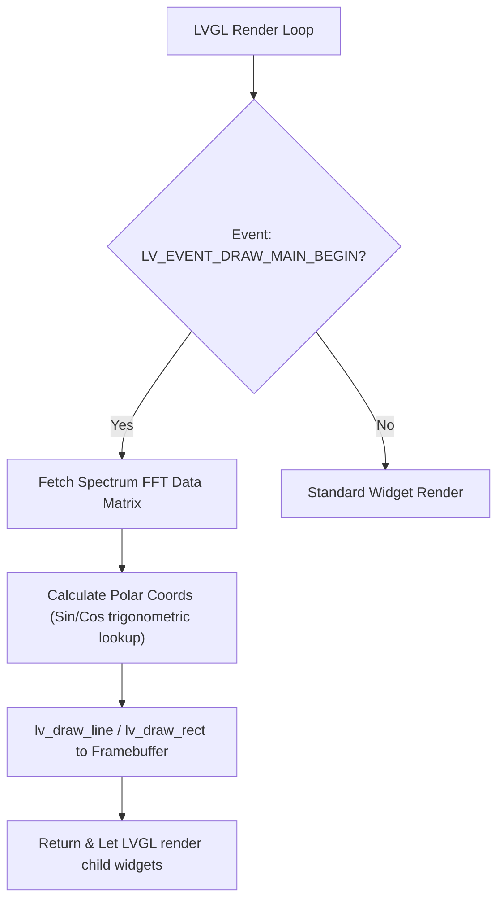
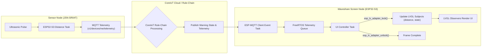
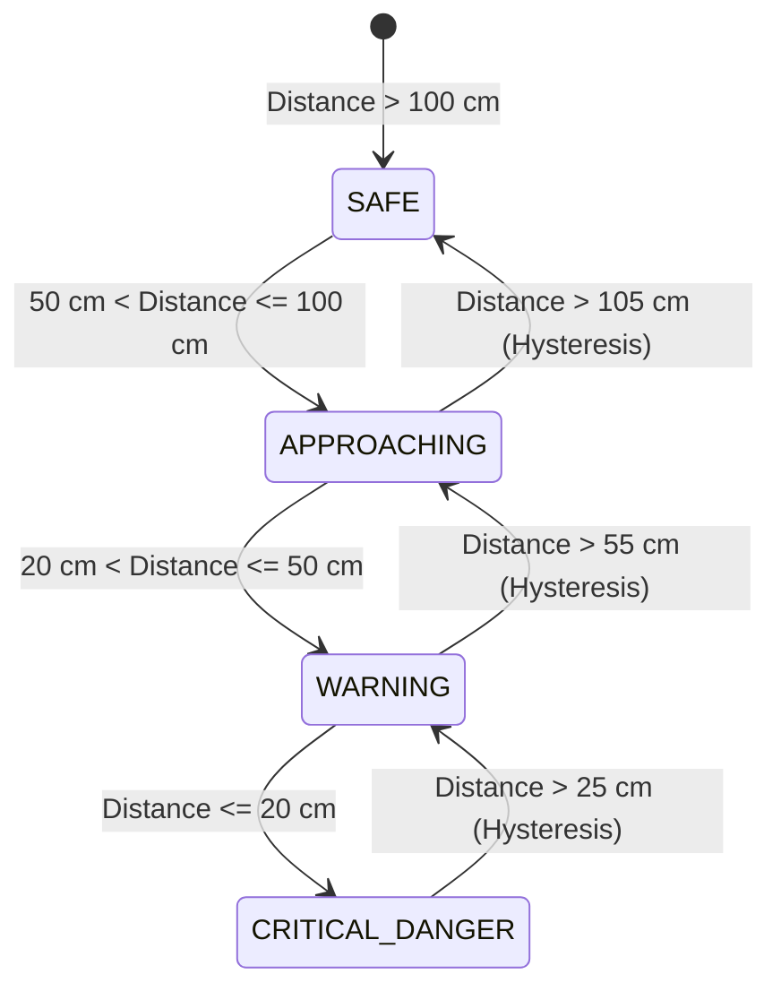

# LVGL `lv_demos` Architecture & Vehicle Warning System Pipeline Guide

> **Document Version**: 2.0 (Session 2 Audit & System Architecture Complete)  
> **Target Platform**: Waveshare ESP32-S3 7-inch RGB Touch LCD (800x480)  
> **LVGL Version**: LVGL v9.x (Managed Component)  
> **Core Applications**: Vehicle Detection Sensor (`sensor-node`) & Display Node (`waveshare-screen`)

---

## 1. Executive Summary & Inventory of `lv_demos`

The LVGL component in [`waveshare-screen/managed_components/lvgl__lvgl/demos`](file:///e:/supersonic-sensor-ACLAB/waveshare-screen/managed_components/lvgl__lvgl/demos) provides standardized reference implementations for UI components, dynamic media rendering, performance profiling, and memory stress testing.

| Demo Name | Entry Function | Memory Threshold | Primary UI Elements & Features | Relevance to Vehicle Warning Display |
| :--- | :--- | :--- | :--- | :--- |
| **`widgets`** | `lv_demo_widgets()` | Heap: ≥ 38 KB (48 KB rec.) | Multi-tab container (`lv_tabview`), responsive layout engine (`DISP_LARGE`), custom scales/charts, subject/observer dynamic color palette switching. | Provides modular layout architecture (`Profile`, `Analytics`, `Settings`), real-time line charts for distance history, and dynamic warning level color switching. |
| **`music`** | `lv_demo_music()` | Heap: ≥ 64 KB + PSRAM assets | Custom draw callbacks (`LV_EVENT_DRAW_MAIN_BEGIN`), dynamic 20-bar spectrum visualizer (`sin`/`cos` math), animation timelines (`lv_anim_t`), swipe gestures. | Offers architectural blueprint for audio-visual warning effects, animated alert spectrums, and low-latency custom object drawing. |
| **`benchmark`** | `lv_demo_benchmark()` | Heap: ≥ 128 KB | Performance measurement harness (FPS, render time, CPU load via `lv_observer`), multi-scene stress tests (rectangles, text, shadows, image blends, arcs). | Establishes rendering performance baselines and PSRAM bandwidth throughput limits for 800x480 RGB LCD at 16-bit color depth (RGB565). |
| **`stress`** | `lv_demo_stress()` | Heap: ≥ 32 KB | Automated object creation & destruction timer (`obj_test_task_cb`), heap fragmentation tracking (`mem_free_start`), auto-deleting popups/toasts. | Supplies lifecycle patterns for temporary alert popups, toast notifications, memory leak validation (<100B fragmentation limit), and 24/7 display stability. |

---

## 2. In-Depth Architectural Analysis of Core `lv_demos`

### 2.1 `lv_demo_widgets`: Modular UI Architecture & Dynamic State Binding

#### Architecture Breakdown
`lv_demo_widgets` demonstrates clean multi-file modularization:
- **[`lv_demo_widgets.c`](file:///e:/supersonic-sensor-ACLAB/waveshare-screen/managed_components/lvgl__lvgl/demos/widgets/lv_demo_widgets.c)**: Orchestrates the root `lv_tabview`, determines display scaling (`disp_size == DISP_LARGE`), and manages header logo/title widgets.
- **[`lv_demo_widgets_profile.c`](file:///e:/supersonic-sensor-ACLAB/waveshare-screen/managed_components/lvgl__lvgl/demos/widgets/lv_demo_widgets_profile.c)**: User metadata forms, status switches, sliders, and avatar image handling.
- **[`lv_demo_widgets_analytics.c`](file:///e:/supersonic-sensor-ACLAB/waveshare-screen/managed_components/lvgl__lvgl/demos/widgets/lv_demo_widgets_analytics.c)**: Complex gauges (`lv_scale`), line charts (`lv_chart`), and real-time metric updates.
- **[`lv_demo_widgets_shop.c`](file:///e:/supersonic-sensor-ACLAB/waveshare-screen/managed_components/lvgl__lvgl/demos/widgets/lv_demo_widgets_shop.c)**: E-commerce style item grid cards and action buttons.
- **[`lv_demo_widgets_components.c`](file:///e:/supersonic-sensor-ACLAB/waveshare-screen/managed_components/lvgl__lvgl/demos/widgets/lv_demo_widgets_components.c)**: Shared design tokens, styles, and reusable custom card containers.

#### Subject/Observer Pattern (LVGL v9 Feature)
`lv_demo_widgets` introduces LVGL v9's reactive programming model using `lv_subject_t` and `lv_observer_t`:
```c
/* Primary theme color subject */
static lv_subject_t theme_color_subject;

/* Observers automatically update widget styles on subject change */
lv_subject_init_color(&theme_color_subject, lv_palette_main(LV_PALETTE_BLUE));
lv_obj_bind_checked(sw, &theme_color_subject);
```
> [!TIP]
> **Vehicle Warning Application**: We map `distance_subject` and `warning_level_subject` to reactive observers. When telemetry arrives via MQTT, setting the subject value automatically updates the distance text label, gauge needle position, and screen background theme color without manual widget traversal!

---

### 2.2 `lv_demo_music`: High-Frequency Custom Drawing & Animation Timelines

#### Custom Spectrum Draw Callback
In [`lv_demo_music_main.c`](file:///e:/supersonic-sensor-ACLAB/waveshare-screen/managed_components/lvgl__lvgl/demos/music/lv_demo_music_main.c), the spectrum analyzer does not use static widgets. Instead, it registers a custom draw event callback (`spectrum_draw_event_cb` on `LV_EVENT_DRAW_MAIN_BEGIN`):



- **Trigonometric Lookup Optimization**: Precomputed integer `sin`/`cos` lookup functions (`get_sin`, `get_cos`) prevent expensive floating-point CPU overhead during 60 FPS animation.
- **Animation Timelines (`lv_anim_t`)**: Multi-stage animation sequences (e.g. album cover fade-in, spectrum height interpolation) are driven by FreeRTOS-compatible LVGL timers (`lv_timer_create`).

---

### 2.3 `lv_demo_benchmark`: Performance Metrics & Hardware Limits

#### Benchmarking Methodology
[`lv_demo_benchmark.c`](file:///e:/supersonic-sensor-ACLAB/waveshare-screen/managed_components/lvgl__lvgl/demos/benchmark/lv_demo_benchmark.c) measures rendering throughput across 20+ distinct visual scenes (solid fills, opacity layers, rotated text, blitted images, arc gauges).

#### Performance Matrix on ESP32-S3 (800x480 RGB565)

| Render Scene | Hardware Bottleneck | Optimizations Required for ESP32-S3 |
| :--- | :--- | :--- |
| **Simple Rectangles & Solid Fills** | Memory bus bandwidth | Utilize SRAM DMA bounce buffers (`bounce_buffer_size_px`). |
| **ARGB Blending / Opacity** | Dual-core CPU pixel math | Keep opacity (`LV_OPA_COVER`) opaque where possible; avoid overlapping translucent layers. |
| **Large Image Scaling & Rotation** | PSRAM read latency | Store UI icons in Flash as C arrays (`LV_IMAGE_DECLARE`) or uncompressed RGB565 in PSRAM. |
| **Arc / Gauge Redraws** | Anti-aliasing GPU math | Limit gauge arc redraw frequency to 20Hz (50ms interval) to save CPU for MQTT/Wi-Fi tasks. |

---

### 2.4 `lv_demo_stress`: Automated Lifecycle & Memory Leak Testing

#### Cyclic Allocation Pattern
[`lv_demo_stress.c`](file:///e:/supersonic-sensor-ACLAB/waveshare-screen/managed_components/lvgl__lvgl/demos/stress/lv_demo_stress.c) runs an automated state machine (`g_state`) inside `obj_test_task_cb` every `LV_DEMO_STRESS_TIME_STEP` (default 50ms):
1. **Creation**: Spawns tabviews, buttons, sliders, text areas, message boxes, and image objects.
2. **Mutation**: Modifies text strings, value ranges, alignments, and container sizes.
3. **Destruction**: Invokes `lv_obj_delete()` and validates memory cleanup.

#### Memory Leak Criteria
```c
/* Benchmark tracks initial free heap */
mem_free_start = lv_mem_get_free();

/* Acceptance Rule: Residual memory fragmentation after full cycle must be < 100 bytes */
```
This test pattern ensures the display node can operate 24/7 in harsh vehicle environments without running out of internal SRAM or PSRAM.

---

## 3. End-to-End System Pipeline Guide for Vehicle Warning Display

This section provides the complete step-by-step pipeline for designing, implementing, and operating the **ESP32-S3 Vehicle Detection & Warning Display Node** based on our audit findings.

### 3.1 Data Flow & Thread-Safety Architecture Pipeline



#### Thread-Safety Rules:
1. **Never Call LVGL APIs Direct from MQTT Callbacks**: MQTT callbacks execute in the `esp_mqtt` event task context. Calling LVGL APIs directly causes memory corruption and crashes.
2. **Locking Mechanism**: Wrap all LVGL modifications in `esp_lv_adapter_lock(-1)` / `esp_lv_adapter_unlock()`.
3. **I2C Bus Protection**: The GT911 touch sensor and CH422G expander share `I2C_NUM_0`. Touch reads occur during LVGL timer ticks, while backlight/relay commands occur in control tasks. An I2C bus mutex is mandatory.

---

### 3.2 UI Screen Hierarchy & Component Design Pipeline

The display interface is organized into a modular 3-Tab layout using `lv_tabview`, inspired by `lv_demo_widgets`:

```
+-------------------------------------------------------------------------+
| [LOGO] Vehicle Warning System | Wi-Fi: OK | MQTT: CoreIoT | [STATUS BADGE] |
+-------------------------------------------------------------------------+
| TAB 1: Live Warning  | TAB 2: Telemetry History | TAB 3: System Config  |
+-------------------------------------------------------------------------+
|                                                                         |
|   +-----------------------+     +----------------------------------+    |
|   |  DYNAMIC DISTANCE ARC |     |  REAL-TIME DISTANCE CHART (cm)   |    |
|   |     [ 12.5 cm ]       |     |  100|----\                       |    |
|   |   STATUS: CRITICAL    |     |   50|     \___                   |    |
|   +-----------------------+     +----------------------------------+    |
|                                                                         |
|   +-----------------------------------------------------------------+   |
|   |  ALERT BANNER: WARNING! VEHICLE DETECTED IN BLIND SPOT (<15cm) |   |
|   +-----------------------------------------------------------------+   |
+-------------------------------------------------------------------------+
```

#### Screen Component Breakdown:
- **Header Bar**: Displays connectivity status (Wi-Fi IP, CoreIoT MQTT ping, system runtime).
- **Tab 1 - Live Warning**:
  - **Dynamic Gauge Arc**: Built using `lv_scale` & `lv_arc` (adapted from `lv_demo_widgets_analytics`). Colors shift automatically based on warning level.
  - **Status Badge**: Pill-shaped badge indicating state (`SAFE`, `APPROACHING`, `WARNING`, `DANGER`).
  - **Alert Banner**: Animated red/yellow warning banner with flashing opacity (`lv_anim_t`) triggered when vehicle distance falls below critical threshold.
- **Tab 2 - Telemetry History**:
  - **Real-Time Line Chart**: `lv_chart` displaying last 50 distance samples with min/max reference threshold lines.
- **Tab 3 - System Config**:
  - Distance threshold sliders (`lv_slider`), alarm sound toggle (`lv_switch`), sensor calibration offset controls.

---

### 3.3 Alert State Machine Pipeline

The warning system operates on a 4-Level State Machine:



#### State Definition & UI Behavior Matrix:

| Warning Level | Distance Range | Arc / Gauge Color | Alert Banner | Audio/Visual Effect | Observer Action |
| :--- | :--- | :--- | :--- | :--- | :--- |
| **`STATE_SAFE`** | > 100 cm | Emerald Green (`#10B981`) | Hidden | None | Background theme set to dark neutral. |
| **`STATE_APPROACHING`** | 50 cm - 100 cm | Amber Yellow (`#F59E0B`) | Static Info ("Vehicle Approaching") | Slow pulse badge (1Hz) | Yellow highlight on distance gauge. |
| **`STATE_WARNING`** | 20 cm - 50 cm | Vivid Orange (`#F97316`) | Warning Banner Active | Medium pulse + Beep | Gauge needle turns orange, warning audio triggered. |
| **`STATE_CRITICAL_DANGER`** | ≤ 20 cm | Flash Crimson Red (`#EF4444`) | Flashing Overlay Banner | Rapid Spectrum Flashing + Continuous Alarm | Full-screen alert popup, dynamic red arc flashing (5Hz). |

> [!IMPORTANT]
> **Hysteresis Policy**: A **5 cm hysteresis buffer** is applied to state transitions to prevent noisy UI toggling when vehicle distance hovers near boundary values (e.g. 20.0 cm).

---

### 3.4 Operational & Resource Management Pipeline

#### 1. Memory & PSRAM Configuration
- **Resolution & Color Depth**: 800x480 @ 16-bit RGB565 (2 bytes/pixel).
- **Framebuffer Location**: Allocate primary & secondary framebuffers in PSRAM (`.fb_in_psram = 1`). Total allocation ~1.5 MB.
- **SRAM Bounce Buffer**: Configure `bounce_buffer_size_px = 800 * 40` (40 lines of internal SRAM) to maintain smooth 60 FPS panel refresh without PSRAM bus contention during Wi-Fi transmissions.
- **LVGL Adapter Task Stack**: 12 KB stack allocated in PSRAM (`stack_in_psram = true`).

#### 2. Startup & Execution Pipeline
```
[Power On]
   |
[Init NVS Flash & GPIO]
   |
[Init I2C Bus Mutex]
   |
[Init CH422G Expander -> Turn LCD Backlight ON & Pulse GT911 Reset]
   |
[Init RGB Panel Driver with PSRAM Framebuffers & SRAM Bounce Buffer]
   |
[Init LVGL Adapter -> Register Display & GT911 Touch Input]
   |
[Start LVGL Adapter Task (12KB PSRAM Stack)]
   |
[Connect Wi-Fi & MQTT Client (CoreIoT Token)]
   |
[Enter Main FreeRTOS Loop & UI Observer Event Dispatching]
```

---

## 4. Summary of Reusable Design Patterns

| Pattern Category | Source Demo | Implemented Feature in Vehicle Warning System |
| :--- | :--- | :--- |
| **State Reactive UI** | `lv_demo_widgets` | `lv_subject_t` / `lv_observer_t` bindings for distance and alert levels. |
| **Custom Graphic Effects** | `lv_demo_music` | Trigonometric integer lookup table for animated warning wave / spectrum effects. |
| **Telemetry History** | `lv_demo_widgets_analytics` | Real-time `lv_chart` with threshold sections (`lv_scale`) for distance trends. |
| **Auto-Expiring Toasts** | `lv_demo_stress` | Auto-deleting modal message boxes (`msgbox_delete`) for transient sensor errors. |
| **Thread & Memory Safety** | `lv_demo_stress` + ESP Adapter | `esp_lv_adapter_lock()` thread synchronization + I2C bus mutex locking. |

---

*(Session 2 Architecture Audit & System Pipeline Guide Completed)*
