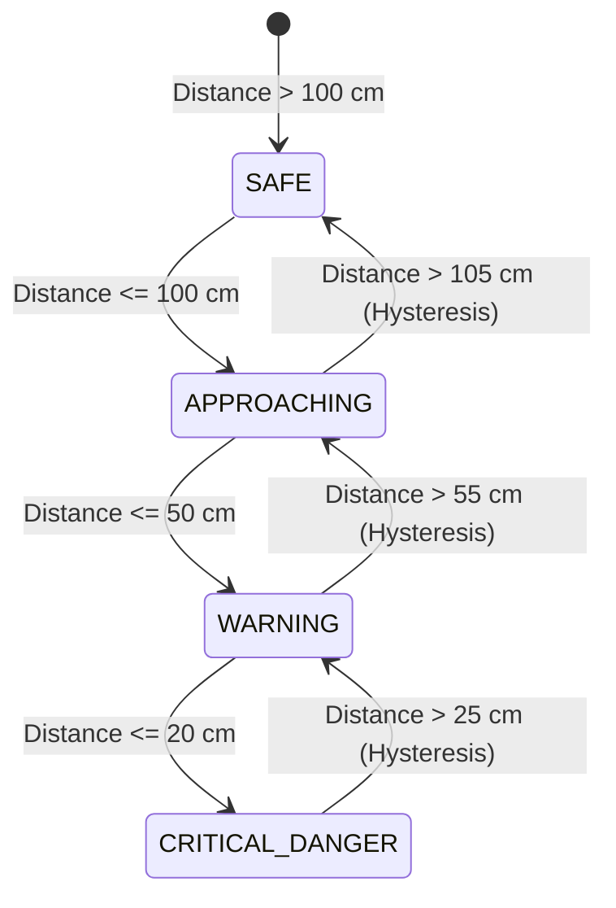
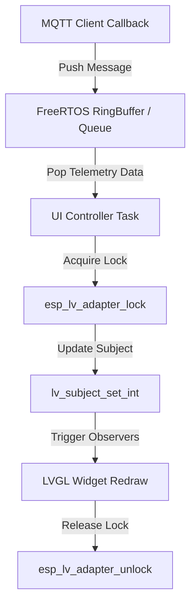

# UI Development Pipeline & Standard Operating Procedure (SOP)

This document establishes the official **UI Development Pipeline and Standard Operating Procedure (SOP)** for building real-time warning displays using **LVGL v9** on the **ESP32-S3** microcontroller paired with a 7-inch RGB Touch LCD (800x480 resolution).

---

## 1. Executive Summary & Design System

### 1.1 Scope & System Context
The display system (`waveshare-screen`) serves as the primary visual and audio alert interface in the Vehicle Detection & Warning System. Telemetry from the `sensor-node` (JSN-SR04T ultrasonic sensor) is processed via the CoreIoT (ThingsBoard) cloud rule-chain and pushed via MQTT. The UI must render distance metrics, indicate threat level states in real-time (< 50ms latency), and maintain high rendering throughput (30+ FPS) without UI tearing or stack overflows.

### 1.2 Design System & Theme Tokens
To deliver a modern, state-of-the-art UI experience, the design system enforces a sleek dark-mode background paired with distinct HSL color tokens for the 4 alert levels:

| Token Name | Hex Code | HSL Value | Visual State | Trigger Condition |
| :--- | :--- | :--- | :--- | :--- |
| `COLOR_BG_DARK` | `#0F172A` | H:222, S:47%, L:11% | Slate Dark Background | Base Layout Canvas |
| `COLOR_SURFACE` | `#1E293B` | H:215, S:28%, L:17% | Card / Container Surface | Widget Panels & Tabs |
| `COLOR_SAFE` | `#10B981` | H:160, S:84%, L:39% | Emerald Green | Distance > 100 cm |
| `COLOR_APPROACHING` | `#F59E0B` | H:38, S:92%, L:50% | Amber Yellow | 50 cm < Distance ≤ 100 cm |
| `COLOR_WARNING` | `#F97316` | H:24, S:95%, L:53% | Vivid Orange | 20 cm < Distance ≤ 50 cm |
| `COLOR_CRITICAL` | `#EF4444` | H:0, S:84%, L:60% | Flash Crimson Red | Distance ≤ 20 cm |

---

## 2. 4-Level Warning State Machine & Hysteresis

To prevent rapid toggle flickering (chatter) when vehicle distance hovers near warning thresholds, a **5cm hysteresis buffer** must be implemented in software:



### 2.1 State Matrix & System Actions

```c
typedef enum {
    WARNING_STATE_SAFE = 0,
    WARNING_STATE_APPROACHING,
    WARNING_STATE_WARNING,
    WARNING_STATE_CRITICAL_DANGER
} warning_state_t;
```

| Warning State | Threshold Range | Color Token | UI Animation Behavior | Audio Alert Tone |
| :--- | :--- | :--- | :--- | :--- |
| **`SAFE`** | > 100 cm | `COLOR_SAFE` | Static arc gauge, neutral status badge | Mute |
| **`APPROACHING`** | 50 cm - 100 cm | `COLOR_APPROACHING` | Yellow arc glow, 1Hz status pulse | Mute |
| **`WARNING`** | 20 cm - 50 cm | `COLOR_WARNING` | Orange warning banner slide-in | 2Hz Beep Tone |
| **`CRITICAL_DANGER`** | ≤ 20 cm | `COLOR_CRITICAL` | Flashing full-screen red overlay (5Hz) | Continuous Rapid Beep |

---

## 3. Modular UI Architecture (3-Tab Layout)

The UI layout utilizes `lv_tabview` to partition responsibility into 3 distinct functional tabs, following patterns proven in `lv_demo_widgets`:

```
┌────────────────────────────────────────────────────────────────────────┐
│                        TOP NAVIGATION TABBAR                           │
│   [ 1. Live Warning ]    [ 2. Telemetry History ]    [ 3. System Config ]│
├────────────────────────────────────────────────────────────────────────┤
│                                                                        │
│  Tab 1: Live Warning                                                   │
│    - Central dynamic distance gauge (`lv_arc` + `lv_scale`)            │
│    - Pill-shaped status badge (`lv_label` with HSL background)         │
│    - Flashing warning overlay banner (`lv_obj_t` with `lv_anim_t`)    │
│                                                                        │
│  Tab 2: Telemetry History                                              │
│    - Real-time chart (`lv_chart`) showing rolling distance samples     │
│    - Horizontal threshold marker lines (Safe/Warning/Critical limits)  │
│                                                                        │
│  Tab 3: System Config                                                  │
│    - Threshold tuning sliders (`lv_slider`)                            │
│    - Alarm sound toggle switch (`lv_switch`)                          │
│    - Sensor zero-point calibration trigger (`lv_button`)              │
│                                                                        │
└────────────────────────────────────────────────────────────────────────┘
```

---

## 4. Reactive Data Flow & Thread Synchronization Pipeline

### 4.1 Architecture & Lock Isolation
ESP32-S3 executes Wi-Fi MQTT network processing and LVGL rendering on separate tasks. Strict thread safety must be preserved:



### 4.2 Code Implementation Pattern (LVGL v9 Reactive Subject/Observer)

```c
// 1. Declare Subjects for Telemetry & State
static lv_subject_t distance_subject;
static lv_subject_t state_subject;

// 2. Initialize Subjects during UI Setup
void ui_pipeline_init(void) {
    lv_subject_init_int(&distance_subject, 150); // Initial 150 cm
    lv_subject_init_int(&state_subject, WARNING_STATE_SAFE);

    // Bind Subjects to UI Widgets
    lv_label_bind_text(distance_label, &distance_subject, "%d cm");
    lv_arc_bind_value(distance_arc, &distance_subject);
}

// 3. Thread-safe Telemetry Processing Task
void telemetry_consumer_task(void *pvParameters) {
    telemetry_msg_t msg;
    while (1) {
        if (xQueueReceive(xTelemetryQueue, &msg, portMAX_DELAY) == pdTRUE) {
            warning_state_t new_state = calculate_state_with_hysteresis(msg.distance_cm);

            // Thread-safe update to LVGL subjects
            if (esp_lv_adapter_lock(pdMS_TO_TICKS(100)) == ESP_OK) {
                lv_subject_set_int(&distance_subject, msg.distance_cm);
                lv_subject_set_int(&state_subject, new_state);
                esp_lv_adapter_unlock();
            }
        }
    }
}
```

---

## 5. Hardware & Memory Optimization SOP

### 5.1 PSRAM & SRAM Bounce Buffer Configuration
- **Dual PSRAM Framebuffers**: Allocate 2 full framebuffers in 8MB PSRAM (`.fb_in_psram = 1`) to eliminate display tearing (~1.5 MB total allocation).
- **Internal SRAM DMA Bounce Buffer**: Allocate a 40-line internal SRAM bounce buffer (`bounce_buffer_size_px = 800 * 40`) to prevent PSRAM bus bandwidth starvation during intense Wi-Fi/MQTT transmissions.

```c
esp_lcd_rgb_panel_config_t panel_config = {
    .data_width = 16,
    .bits_per_pixel = 16,
    .psram_trans_align = 64,
    .bounce_buffer_size_px = 800 * 40,
    .flags.fb_in_psram = 1, // Full framebuffers in external PSRAM
};
```

### 5.2 I2C Shared Bus Mutex Rules
The GT911 Touch Controller and CH422G IO Expander (controlling LCD backlight & touch reset) share the same I2C bus (`I2C_NUM_0`).
- **Rule**: All CH422G writes and GT911 touch reads MUST acquire `xI2C_Mutex` before performing I2C transactions.
- **Timeout**: 20ms maximum wait time per I2C lock acquisition.

---

## 6. Developer SOP & Verification Checklist

When adding or modifying UI components on `waveshare-screen`:

1. **[ ] Memory Audit**: Ensure all custom structures and persistent dynamic objects are allocated in PSRAM or capped within heap limits (< 40KB internal SRAM usage for UI).
2. **[ ] Thread Safety**: Verify no LVGL API call (`lv_obj_create`, `lv_label_set_text`, etc.) is called from an MQTT callback or hardware timer ISR without acquiring `esp_lv_adapter_lock()`.
3. **[ ] Custom Drawing**: Use `sin`/`cos` integer lookup tables on custom draw callbacks (`LV_EVENT_DRAW_MAIN_BEGIN`) to avoid floating-point performance stalls.
4. **[ ] Verification**:
   - Build test: `cd waveshare-screen && build_and_flash.bat build`
   - Flash & Monitor test: `build_and_flash.bat all COM9`
   - MQTT Simulation test: `python tools/test_mqtt_coreiot.py --loop --interval 2`

---

*Document generated as part of Session 3 UI Development Pipeline & SOP formulation.*
