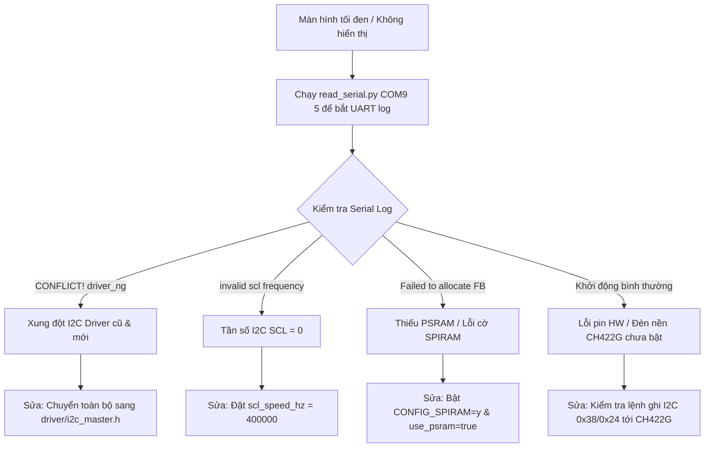

# ESP32-S3 Display & Peripheral Debugging Skill

This skill provides a systematic methodology for capturing runtime serial logs, diagnosing blank/black screens, resolving ESP-IDF v6 driver conflicts, and verifying hardware initialization for ESP32-S3 microcontrollers with RGB LCD displays and touch controllers.

---

## Required Environment & Tools

### Environment Configuration
- **ESP-IDF Path**: `E:\esp\v6.0.2\esp-idf`
- **Python Virtual Env**: `C:\Espressif\tools\python\v6.0.2\venv\Scripts\python.exe`
- **PowerShell Profile**: `C:\Espressif\tools\Microsoft.v6.0.2.PowerShell_profile.ps1`
- **Default Ports**:
  - `COM9`: Waveshare ESP32-S3 Touch LCD 7 (`waveshare-screen`)
  - `COM8`: Core Sensor Node (`sensor-node`)

### Essential Debugging Tools
1. **Python Serial Capture Script**:
   Located at `scripts/read_serial.py`.
   Use this tool when `idf_monitor` fails in non-interactive shells (since `idf_monitor.py` requires a TTY terminal).
   ```cmd
   C:\Espressif\tools\python\v6.0.2\venv\Scripts\python.exe scripts/read_serial.py COM9 5
   ```
2. **Batch Build & Flash Utility**:
   Located at `build_and_flash.bat` (project root). Supports non-destructive incremental builds and auto-flashing.

---

## Debugging Methodology for Black / Dark Screen Symptoms

When a display remains black or unresponsive after flashing:



### Step 1: Capture Empirical Log Evidence
Never guess hardware failure without reading UART boot output first.
Run the Python serial reader immediately after flashing:
```cmd
C:\Espressif\tools\python\v6.0.2\venv\Scripts\python.exe .agents/skills/esp32_screen_debug/scripts/read_serial.py COM9 5
```

### Step 2: Match Diagnostic Log Patterns

#### Pattern A: I2C Driver Coexistence Conflict
- **Log Pattern**: `E (439) i2c: CONFLICT! driver_ng is not allowed to be used with this old driver`
- **Root Cause**: Mixing legacy `driver/i2c.h` (`i2c_driver_install`) with new `driver/i2c_master.h` (`i2c_new_master_bus`) used by managed components (e.g. `esp_lcd_touch_gt911`).
- **Fix**: Replace all calls to `i2c_driver_install()` and `i2c_master_write_to_device()` with `i2c_new_master_bus()` and `i2c_master_transmit()`.

#### Pattern B: Invalid SCL Frequency
- **Log Pattern**: `E (918) i2c.master: i2c_master_bus_add_device(...): invalid scl frequency`
- **Root Cause**: Setting `scl_speed_hz = 0` in `esp_lcd_panel_io_i2c_config_t`.
- **Fix**: Explicitly set `tp_io_config.scl_speed_hz = 400 * 1000;` (400kHz).

#### Pattern C: PSRAM Framebuffer Allocation Failure
- **Log Pattern**: `esp_lcd_panel_rgb: alloc frame buffer failed` or `Guru Meditation Error: Core 0 panic'ed (LoadProhibited)`
- **Root Cause**: Missing octal PSRAM config in `sdkconfig.defaults`.
- **Fix**: Ensure the following options are set:
  ```ini
  CONFIG_SPIRAM=y
  CONFIG_SPIRAM_MODE_OCT=y
  CONFIG_SPIRAM_SPEED_80M=y
  ```
  And in code: `disp_config.profile.use_psram = true;`

#### Pattern D: GCC 15 Compiler Macro Error
- **Build Error**: `error: 'attributes' attribute directive ignored [-Werror=attributes]`
- **Fix**: In root `CMakeLists.txt`:
  ```cmake
  add_compile_options("-Wno-attributes")
  ```

---

## Verification Checklist

1. **Build & Flash**: Run `build_and_flash.bat` from this project's root. Ensure 0 build errors.
2. **UART Inspection**: Run `read_serial.py COM9 5`. Verify lines:
   - `lcd_port: Initialize RGB LCD panel`
   - `GT911: TouchPad_ID: 0x39...`
   - `esp_lvgl:adapter: LVGL task started successfully`
3. **Screen Output**: Verify backlight powers on and LVGL UI elements render.
