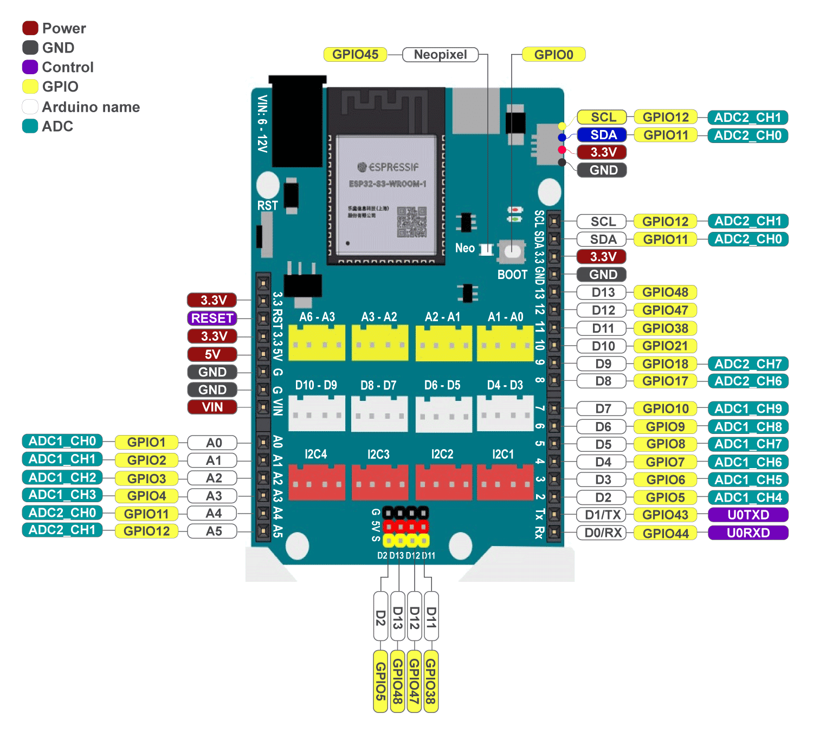
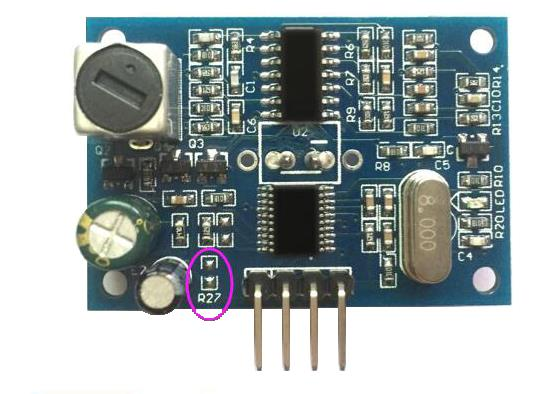
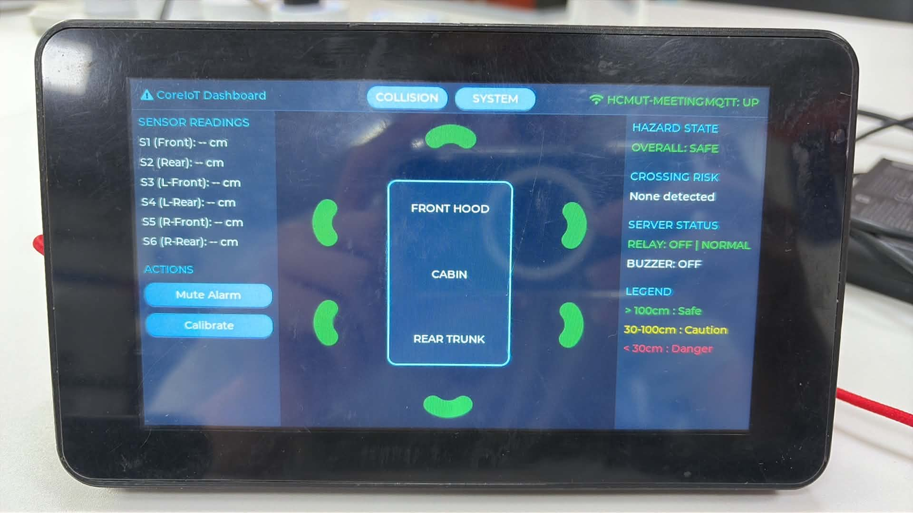
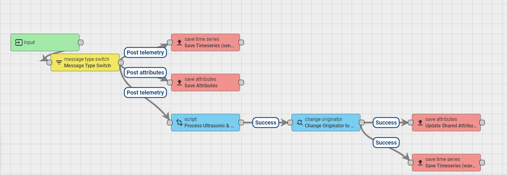

# Báo cáo Kỹ thuật — Hệ thống Cảnh báo Va chạm bằng Cảm biến Siêu âm JSN-SR04T & CoreIoT

> Tài liệu này là bản báo cáo **đầy đủ** (kèm nhật ký phát triển, sự cố đã gặp và hạn chế hiện tại) của dự án [`supersonic-sensor-ACLAB`](https://github.com/YdtTran/supersonic-warning-system). Bản báo cáo **trang trọng, chỉ mô tả hệ thống ở trạng thái hiện tại** (không có log/lịch sử) nằm ở [`report.tex`](report.tex) / [`report.pdf`](report.pdf), biên dịch bằng pdflatex (MiKTeX).
>
> Tài liệu này tập trung vào **kiến trúc, quyết định thiết kế và lịch sử phát triển**. Để tra cứu **API từng thư viện/component** (chữ ký hàm, ví dụ code) và **hướng dẫn cấu hình bằng phần mềm** (đổi Wi-Fi/MQTT, thêm cảm biến, đổi ngưỡng cảnh báo, cấu hình Rule-Chain), xem [`docs/API_GUIDE.md`](../docs/API_GUIDE.md).

---

## Mục lục

1. [Giới thiệu & Mục tiêu](#1-giới-thiệu--mục-tiêu)
2. [Kiến trúc tổng quan](#2-kiến-trúc-tổng-quan)
3. [Phần cứng sử dụng](#3-phần-cứng-sử-dụng)
4. [Công cụ & Framework](#4-công-cụ--framework)
5. [Firmware `sensor-node`](#5-firmware-sensor-node)
6. [Firmware `waveshare-screen`](#6-firmware-waveshare-screen)
7. [Cloud CoreIoT (Rule-Chain)](#7-cloud-coreiot-rule-chain)
8. [Prototype thử nghiệm](#8-prototype-thử-nghiệm)
9. [Nhật ký & lịch sử phát triển](#9-nhật-ký--lịch-sử-phát-triển)
10. [Hạn chế & việc cần làm thêm](#10-hạn-chế--việc-cần-làm-thêm)
11. [Ảnh minh hoạ & đề xuất bổ sung](#11-ảnh-minh-hoạ--đề-xuất-bổ-sung)

---

## 1. Giới thiệu & Mục tiêu

Dự án xây dựng hệ thống nhúng phát hiện vật cản/xe cộ ở khoảng cách gần bằng **cảm biến siêu âm chống nước JSN-SR04T**, gắn trên vi điều khiển **ESP32-S3 (board Yolo:Uno)**. Dữ liệu khoảng cách được gửi lên nền tảng IoT **CoreIoT (ThingsBoard)** qua MQTT, xử lý ngưỡng cảnh báo bằng **Rule-Chain**, và định tuyến kết quả xuống **màn hình cảm ứng Waveshare ESP32-S3 Touch LCD 7"** để hiển thị trực quan (dashboard va chạm kiểu "no-zone" quanh xe) đồng thời điều khiển còi cảnh báo vật lý.

Ý tưởng gốc (xem `architecture.png`) là hệ thống 6 cảm biến bao quanh toàn bộ xe (trước/sau/4 góc) kết hợp cảnh báo cho người đi đường. **Hệ thống hiện tại đã triển khai 2/6 cảm biến** (S3 – trước-trái, S5 – trước-phải) trên phần cứng thật và hoạt động ổn định; phần còn lại (4 cảm biến + cảnh báo ngoài xe) **đang chờ bổ sung phần cứng**, không phải là thu hẹp phạm vi dự án.

## 2. Kiến trúc tổng quan

```text
 ┌────────────────────────┐
 │   Cảm biến JSN-SR04T   │  x2 hiện tại (S3 trước-trái, S5 trước-phải), kiến trúc hỗ trợ tối đa 6
 └───────────┬────────────┘
             │ Echo / Trig GPIO
             ▼
 ┌────────────────────────┐
 │  ESP32-S3 Sensor Node  │  firmware/sensor-node — đo, lọc nhiễu, còi báo cục bộ
 └───────────┬────────────┘
             │ Wi-Fi MQTT (v1/devices/me/telemetry)
             ▼
 ┌────────────────────────┐
 │  CoreIoT Cloud Server  │  app.coreiot.io — Rule-Chain tính ngưỡng WARNING/DANGER
 └───────────┬────────────┘
             │ MQTT Shared Attributes (đổi originator sang waveshare-screen)
             ▼
 ┌────────────────────────┐
 │ Waveshare Screen Node  │  firmware/waveshare-screen — dashboard LVGL 800x480
 └────────────────────────┘
```

Sơ đồ ý tưởng gốc (6 cảm biến bao quanh xe, đề xuất ban đầu của nhóm — **chưa phải hiện trạng phần cứng**):


## 3. Phần cứng sử dụng

| Thành phần | Mô tả |
|---|---|
| MCU | **Yolo:Uno** — board phát triển dựa trên **ESP32-S3-WROOM-1** (Dual-Core 240MHz, Wi-Fi/BLE, PSRAM Octal). Pinout đầy đủ bên dưới. |
| Cảm biến khoảng cách | **JSN-SR04T** — cảm biến siêu âm chống nước, tách rời đầu dò và board mạch, hỗ trợ nhiều "Mode" hoạt động (UART tự động đo / phát xung Trig-Echo thủ công) chọn bằng điện trở `R27` trên board (xem ảnh bên dưới). |
| Màn hình hiển thị | **Waveshare ESP32-S3 Touch LCD 7"** — panel RGB 800×480, cảm ứng dung kháng **GT911** (I2C, 400kHz Fast-mode), IO-expander **CH422G** (I2C, địa chỉ `0x24`/`0x38`) điều khiển backlight, reset cảm ứng, chip-select thẻ SD và MUX CAN. |
| Cảnh báo cục bộ | Còi buzzer GPIO48 gắn trực tiếp trên `sensor-node` — phản hồi ngay lập tức không qua round-trip cloud. |





*Điện trở `R27` (khoanh hồng) là jumper chọn giữa Mode UART tự động (module tự đo và trả khoảng cách qua UART) và Mode 3 (vi điều khiển tự phát xung Trig, đọc độ rộng xung Echo) — chi tiết debug thực tế xem [mục 9](#9-nhật-ký--lịch-sử-phát-triển).*

Ảnh chụp dashboard chạy trên phần cứng thật:



## 4. Công cụ & Framework

| Hạng mục | Lựa chọn | Lý do |
|---|---|---|
| Build system | **PlatformIO** (`pio run -e yolo_uno`) cho cả 2 firmware | Layout thống nhất (`src/`, `boards/`, `platformio.ini`, `build_and_flash.bat`), một toolchain quản lý cả 2 dự án khác framework. |
| `sensor-node` | `framework = arduino` | Tái sử dụng hệ sinh thái thư viện Arduino-ESP32 sẵn có (`WiFi.h`, `PubSubClient`) — đủ dùng cho tác vụ đo/lọc/publish MQTT đơn giản, không cần driver màn hình phức tạp. |
| `waveshare-screen` | `framework = espidf` **thuần** (không Arduino) | **Quyết định kiến trúc quan trọng**: driver màn hình/cảm ứng hiện đại (`esp_lvgl_adapter`, `esp_lcd_touch_gt911` bản mới, API I2C `i2c_master.h`, LVGL 9.1, `esp_lcd_panel_rgb` với `num_fbs`/bounce-buffer) đòi hỏi **ESP-IDF ≥ 5.5**, trong khi tổ hợp `framework = arduino, espidf` của PlatformIO chỉ cấp **ESP-IDF 4.4.7** — không tương thích. Xem chi tiết quá trình quyết định ở [mục 9](#9-nhật-ký--lịch-sử-phát-triển). |
| Đồ hoạ UI | **LVGL 9.1** + `espressif/esp_lvgl_adapter` | Thư viện GUI nhúng mã nguồn mở phổ biến nhất cho ESP32, adapter chính thức của Espressif quản lý sẵn vòng lặp render + khoá luồng an toàn. |
| Cloud IoT | **CoreIoT (ThingsBoard)** | Nền tảng MQTT-native miễn phí, có sẵn Rule-Chain kéo-thả để xử lý ngưỡng cảnh báo mà không cần viết backend riêng. |
| Biên dịch báo cáo | **MiKTeX + pdflatex** (đã cài sẵn) | Dùng để build `report.tex` → `report.pdf`. |

## 5. Firmware `sensor-node`

### 5.1 Kiến trúc tác vụ FreeRTOS

[`firmware/sensor-node/src/main.cpp`](https://github.com/YdtTran/supersonic-warning-system/blob/main/firmware/sensor-node/src/main.cpp) tạo 3 task FreeRTOS trong [`setup()`](https://github.com/YdtTran/supersonic-warning-system/blob/main/firmware/sensor-node/src/main.cpp#L317-L355):

| Task | Stack | Priority | Core | Vai trò |
|---|---|---|---|---|
| `SensorTask` | 4096 | 2 | 1 | Trigger + đọc tuần tự từng cảm biến (tránh nhiễu âm học giữa các cảm biến), đưa qua bộ lọc, ghi kết quả vào `SharedState` (mutex). |
| `AppTask` | 2048 | 1 | 1 | Ví dụ tiêu thụ dữ liệu đã lọc song song, độc lập chu kỳ đo (bật LED khi có vật gần). |
| `NetworkTask` | 4096 | 1 | 0 | Kết nối Wi-Fi/MQTT tới CoreIoT, publish khoảng cách 2 cảm biến (S3/S5) mỗi `COREIOT_PUBLISH_INTERVAL_MS`, tách khỏi core 1 để không ảnh hưởng timing đo (ràng buộc bằng microsecond). |

Ngoài ra [`buzzerTask()`](https://github.com/YdtTran/supersonic-warning-system/blob/main/firmware/sensor-node/src/main.cpp#L197-L257) (dòng 197-257) đã được viết đầy đủ logic còi cảnh báo nhưng **cần xác minh có được khởi tạo bằng `xTaskCreatePinnedToCore` trong `setup()` hay chưa** — xem [mục 10](#10-hạn-chế--việc-cần-làm-thêm).

> API chi tiết + ví dụ code của `UltrasonicSensor`, `DistanceFilter`, `SharedState`, `CoreiotClient`: [`docs/API_GUIDE.md` mục 1](../docs/API_GUIDE.md#1-firmwaresensor-node-arduino--thư-viện-đo--lọc-cảm-biến).

### 5.2 Bộ lọc khoảng cách (Cluster + EMA)

Tham số cấu hình đầy đủ tại [`firmware/sensor-node/include/Config.h`](https://github.com/YdtTran/supersonic-warning-system/blob/main/firmware/sensor-node/include/Config.h):

| Tham số | Giá trị | Ý nghĩa |
|---|---|---|
| `HISTORY_SIZE` | 9 | Số mẫu RAW gần nhất lưu lại để phân cụm. |
| `MIN_SAMPLES_TO_FILTER` | 5 | Cần tối thiểu 5 mẫu mới bắt đầu xuất kết quả. |
| `MIN_CLUSTER_SIZE` | 5 | Một cụm hợp lệ phải chiếm ít nhất 5/9 mẫu gần nhất. |
| `BASE_CLUSTER_TOLERANCE_CM` / `CLUSTER_TOLERANCE_RATIO` | 8 cm / 0.08 | Dung sai để 2 mẫu được xem là cùng cụm, tăng theo khoảng cách (nhiễu tỉ lệ thuận với khoảng cách đo). |
| `EMA_ALPHA` | 0.30 | Hệ số làm mượt kết quả cuối (EMA — Exponential Moving Average). |
| `MIN_JUMP_THRESHOLD_CM` / `JUMP_THRESHOLD_RATIO` | 30 cm / 0.25 | Ngưỡng xem là "bước nhảy lớn" (vật cản mới xuất hiện/biến mất). |
| `JUMP_CONFIRM_COUNT` | 3 | Bước nhảy phải được xác nhận liên tiếp 3 lần trước khi chấp nhận, tránh nhiễu tức thời. |
| `RESET_AFTER_INVALID` | 15 | Sau 15 lần đọc lỗi liên tiếp, reset bộ lọc và báo mất tín hiệu. |

Lý do dùng cluster+EMA thay vì lọc trung vị đơn giản: cảm biến siêu âm giá rẻ (JSN-SR04T) dễ có outlier do phản xạ đa hướng — phân cụm loại outlier hiệu quả hơn, EMA làm mượt kết quả hiển thị mà vẫn phản ứng nhanh với thay đổi thật (xác nhận bằng "jump" logic).

> Cách tinh chỉnh các tham số này (làm mượt hơn/phản ứng nhanh hơn, thêm cảm biến, đổi Wi-Fi/MQTT) không cần sửa logic: [`docs/API_GUIDE.md` mục 3](../docs/API_GUIDE.md#3-cấu-hình-bằng-phần-mềm--không-cần-sửa-code-logic).

### 5.3 Kết nối CoreIoT (MQTT)

[`firmware/sensor-node/src/CoreiotClient.cpp`](https://github.com/YdtTran/supersonic-warning-system/blob/main/firmware/sensor-node/src/CoreiotClient.cpp) dùng `WiFi.h` (STA mode) + `PubSubClient`: kết nối MQTT broker CoreIoT với **access token làm username, không cần password** (chuẩn ThingsBoard), publish JSON `{"left_front":..,"right_front":..}` lên topic telemetry mỗi 2 giây (2Hz), tự thử kết nối lại khi mất kết nối (không gọi lại `WiFi.begin()` liên tục để tránh reset trạng thái đang thử kết nối nền của STA mode).

### 5.4 Buzzer cảnh báo cục bộ

Ngưỡng đồng bộ với Rule-Chain phía server (cùng công thức để không lệch pha giữa còi vật lý và hiển thị màn hình):

- **WARNING** (20–50 cm): kêu 1 lần mỗi 3 giây.
- **DANGER** (< 20 cm): kêu 1 lần mỗi 1 giây.
- Độ dài mỗi tiếng kêu: 120 ms, không chặn (non-blocking, dùng `millis()`).

## 6. Firmware `waveshare-screen`

### 6.1 [`coreiot_client`](https://github.com/YdtTran/supersonic-warning-system/tree/main/firmware/waveshare-screen/components/coreiot_client) — kết nối mạng thuần ESP-IDF

Không dùng Arduino core nên không có `WiFi.h`/`PubSubClient` — thay bằng API ESP-IDF gốc:

- `esp_wifi.h`, `esp_event.h`, `esp_netif.h`, `mqtt_client.h` (component **esp-mqtt**), `nvs_flash.h`.
- Chuỗi khởi tạo: `nvs_flash_init` → `esp_netif_init` → `esp_event_loop_create_default` → `esp_netif_create_default_wifi_sta` → `esp_wifi_init/set_mode/set_config/start`, sau đó `esp_mqtt_client_init` + `esp_mqtt_client_register_event`.
- Khi `MQTT_EVENT_CONNECTED`: subscribe topic telemetry, `v1/devices/me/attributes`, và `v1/devices/me/attributes/response/+` (đồng bộ trạng thái ban đầu), rồi publish một bản tin "reboot event".
- Dữ liệu đến được chuyển ra ngoài qua callback thô (topic/payload con trỏ) — việc parse JSON nằm ở lớp gọi ([`firmware/waveshare-screen/src/main.c`](https://github.com/YdtTran/supersonic-warning-system/blob/main/firmware/waveshare-screen/src/main.c)), giữ `coreiot_client` framework-agnostic.

### 6.2 [`sensor_model`](https://github.com/YdtTran/supersonic-warning-system/tree/main/firmware/waveshare-screen/components/sensor_model) — mô hình dữ liệu dùng chung

Struct 6 cảm biến (`SENSOR_MODEL_COUNT`), mỗi phần tử gồm `distance_cm`, góc lắp `offset_deg` cố định (trước=0°, sau=180°, 2 bên=±90°), cờ `is_stale`; bảo vệ bằng 1 mutex FreeRTOS dùng chung cho mọi task đọc/ghi. Hàm `sensor_model_classify()` phân loại khoảng cách thành 3 vùng: **SAFE** (>100cm) / **CAUTION** (30–100cm) / **DANGER** (<30cm).

### 6.3 [`ui_dashboard`](https://github.com/YdtTran/supersonic-warning-system/tree/main/firmware/waveshare-screen/components/ui_dashboard) — giao diện LVGL 9.1

Widget sử dụng: `lv_arc_*` (6 cung "chùm sóng" quanh sơ đồ xe), `lv_label_set_text_fmt` (số liệu động), `lv_anim_*` (hiệu ứng nhấp nháy vùng nguy hiểm), `lv_timer_create` (refresh thông tin hệ thống mỗi 2s), layout flex (`lv_obj_set_flex_flow/align`). Tab COLLISION/SYSTEM được tự dựng bằng 2 nút + `LV_OBJ_FLAG_HIDDEN` (không dùng `lv_tabview` có sẵn của LVGL, để tuỳ biến giao diện dễ hơn).

**Cơ chế khoá luồng** `esp_lv_adapter_lock()`/`unlock()`: vì các callback Wi-Fi/MQTT chạy trên task khác với task LVGL (esp_lv_adapter chạy LVGL trong task riêng, stack 12KB trong PSRAM), mọi thao tác cập nhật UI từ `NetworkTask` phải khoá trước khi gọi API LVGL. Ban đầu dùng timeout vô hạn (`-1`) — tiềm ẩn treo toàn hệ thống nếu task LVGL bị kẹt; đã sửa thành `LV_LOCK_TIMEOUT_TICKS = pdMS_TO_TICKS(100)` cho mọi lần khoá từ network callback. Riêng lần khoá lúc khởi tạo UI trong `app_main()` (trước khi `NetworkTask` chạy, không có tranh chấp) vẫn giữ `-1`.

> API chi tiết + ví dụ code của `sensor_model`, `coreiot_client`, `ui_dashboard`: [`docs/API_GUIDE.md` mục 2](../docs/API_GUIDE.md#2-firmwarewaveshare-screen-esp-idf--component-dashboard).

### 6.4 BSP — driver phần cứng màn hình

[`firmware/waveshare-screen/src/bsp/waveshare_rgb_lcd_port.c`](https://github.com/YdtTran/supersonic-warning-system/blob/main/firmware/waveshare-screen/src/bsp/waveshare_rgb_lcd_port.c):

- Panel RGB: `esp_lcd_rgb_panel_config_t` + `esp_lcd_new_rgb_panel()` + `esp_lcd_panel_init()` — độ phân giải 800×480, RGB565, xung clock pixel 16MHz, framebuffer cấp phát trong **PSRAM** (`flags.fb_in_psram=1`), số lượng framebuffer lấy từ `esp_lv_adapter_get_required_frame_buffer_count()`.
- I2C bus dùng API mới `driver/i2c_master.h` (`i2c_new_master_bus`, `i2c_master_bus_add_device`, `i2c_master_transmit`) — dùng chung cho cả CH422G lẫn reset GT911.
- **CH422G**: không có driver ESP-IDF riêng, điều khiển bằng ghi thanh ghi thô qua địa chỉ I2C `0x24`/`0x38` (backlight, reset cảm ứng, CS thẻ SD, MUX CAN).
- **GT911**: dùng driver chính thức `esp_lcd_touch_gt911.h` — `esp_lcd_new_panel_io_i2c()` + `ESP_LCD_TOUCH_IO_I2C_GT911_CONFIG()` + `esp_lcd_touch_new_i2c_gt911()`.

## 7. Cloud CoreIoT (Rule-Chain)



Rule-Chain [`cloud/coreiot/rule_chain/supersonic_rule_chain.json`](https://github.com/YdtTran/supersonic-warning-system/blob/main/cloud/coreiot/rule_chain/supersonic_rule_chain.json) xử lý bản tin telemetry từ `sensor-node`:

1. **Message Type Switch** → tách luồng "Post telemetry" (lưu timeseries thô) và luồng xử lý chính.
2. **Process Ultrasonic & Vehicle Data** (script JS, `TbTransformMsgNode`):
   - `dist = min(left_front, right_front)` (hoặc giá trị còn lại nếu chỉ 1 cảm biến có dữ liệu).
   - `vehicle_detected = 0 < dist <= 50 cm`.
   - `warning_status`: `"DANGER"` nếu `dist < 20cm`, `"WARNING"` nếu phát hiện nhưng chưa tới ngưỡng nguy hiểm, ngược lại `"NORMAL"`.
   - `relay`: `"ON"/"OFF"` theo `vehicle_detected` (mô phỏng relay điều khiển ngoài).
   - `buzzer`: mirror `relay` — **chỉ để hiển thị đồng bộ trên màn hình**, còi vật lý thật được điều khiển cục bộ ngay trên `sensor-node` (không round-trip qua cloud) để giữ độ trễ thấp.
3. **Change Originator to waveshare-screen** — đổi chủ thể bản tin sang thiết bị màn hình.
4. **Update Shared Attributes** (`SHARED_SCOPE`, `notifyDevice=true`) — đẩy dữ liệu đã xử lý xuống `waveshare-screen` qua MQTT shared-attributes, đồng thời lưu lịch sử timeseries riêng cho thiết bị này.

Lý do chọn CoreIoT: nền tảng ThingsBoard mã nguồn mở/miễn phí, hỗ trợ MQTT gốc, Rule-Chain kéo-thả cho phép viết logic ngưỡng bằng JavaScript ngay trên UI mà không cần triển khai backend riêng, phù hợp quy mô dự án học thuật/prototype.

> Chi tiết từng node, script JS đầy đủ, cách sửa ngưỡng cảnh báo và lưu ý khi import/deploy sang tenant CoreIoT khác: [`docs/API_GUIDE.md` mục 4](../docs/API_GUIDE.md#4-rule-chain-coreiot--cấu-hình--api-node).

## 8. Prototype thử nghiệm

Prototype [`pulse-read-prototype`](https://github.com/YdtTran/supersonic-warning-system/tree/main/prototypes/pulse-read-prototype): đọc trực tiếp xung Trig/Echo qua GPIO (JSN-SR04T ở **Mode 3**, không qua UART) thay vì giải mã khung UART như `sensor-node`. Đo time-of-flight trực tiếp cho kết quả ổn định và ít nhiễu hơn. Quá trình debug thực tế xem [mục 9](#9-nhật-ký--lịch-sử-phát-triển).

## 9. Nhật ký & lịch sử phát triển

### 9.1 Tái cấu trúc thư mục & dashboard va chạm 6-cảm-biến (kiểu "no-zone")

Tái cấu trúc thư mục gốc (`sensor-node/waveshare-screen` → `firmware/`, `coreiot/` → `cloud/coreiot/`, `sub/` → `reference/`, gộp version logs vào `docs/logs/`, dùng `git mv` giữ lịch sử). Viết lại `waveshare-screen` thành 3 component `sensor_model`/`coreiot_client`/`ui_dashboard`, dashboard va chạm 6 cảm biến kiểu "no-zone" của xe tải, tab COLLISION/SYSTEM. Build + flash + verify qua serial thành công. Sửa layout cảm biến theo đúng datasheet (75°, 20cm–6m) và fix lỗi canvas bị lệch tâm (thiếu `pad_column=0`).

### 9.2 Publish 2 cảm biến & sự cố regression

Thêm publish MQTT S3(left_front)/S5(right_front) lên CoreIoT, cập nhật rule chain. Trong quá trình debug Wi-Fi (đổi SSID `ACLAB` → `HCMUT-MEETING`), phát hiện và fix một regression: `SENSOR_COUNT=1` khiến mất dữ liệu S5. Merge [`feature/hardware-uart-gpio44`](https://github.com/YdtTran/supersonic-warning-system/tree/feature/hardware-uart-gpio44) → `main`.

### 9.3 Prototype `pulse-read-prototype` — debug mode cảm biến

Đọc xung trig/echo trực tiếp qua GPIO (SR04M-2 Mode 3) thay vì UART. Quá trình debug khá vất vả: ban đầu tưởng board GT911 bị treo, hoá ra pin-mapping đúng nhưng **module cảm biến đang ở sai Mode** (cần chỉnh jumper `R27` — xem ảnh mục 3). Sau khi sửa, hệ thống chạy rất ổn định và ít nhiễu hơn UART vì đo time-of-flight trực tiếp thay vì giải mã khung UART.

### 9.4 Quyết định kiến trúc: Arduino hybrid thất bại → ESP-IDF thuần

Yêu cầu refactor toàn bộ `waveshare-screen` sang layout PlatformIO trên nhánh `refactor/arduino` (đã merge trực tiếp vào `main` qua commit [`2546d9f`](https://github.com/YdtTran/supersonic-warning-system/commit/2546d9f), nhánh đã bị xoá sau đó). Thử hybrid `framework = arduino, espidf` trước — **thất bại thật sự**: PlatformIO chỉ cấp ESP-IDF 4.4.7 cho tổ hợp có Arduino, trong khi LVGL 9.1/`esp_lvgl_adapter`/GT911 mới cần IDF ≥5.5 (lỗi version-solving của Component Manager, xem [`docs/logs/waveshare-screen_ARDUINO_REFACTOR_LOG.md`](https://github.com/YdtTran/supersonic-warning-system/blob/main/docs/logs/waveshare-screen_ARDUINO_REFACTOR_LOG.md)). Đã đổi hướng dùng `framework = espidf` thuần (không Arduino thật sự), chỉ đổi sang layout PlatformIO (`src/`, `boards/`, `platformio.ini`) để khớp cách tổ chức các project khác trong repo. **Lưu ý:** tên nhánh `refactor/arduino` không phản ánh đúng thực tế — code vẫn là ESP-IDF thuần, không phải Arduino. PlatformIO's ESP-IDF builder cũng đòi hỏi thư mục `src/` tồn tại ở gốc project bất kể dùng Arduino hay không — nên `main/` đã đổi tên thành `src/`.

Kết quả build: `sensor-node` build sạch không đổi (2.37s). `waveshare-screen` build thành công sau khi chuyển framework (544.92s lần đầu — tải toolchain + ESP-IDF 6.0.1 + managed_components, ~264MB+). Tại thời điểm ghi log, **chưa flash/monitor trên phần cứng thật** trong môi trường thực hiện thay đổi — cần người có phần cứng xác nhận trước khi merge (ghi chú lịch sử; theo timeline làm việc thực tế sau đó, việc build đã được xác nhận trên phần cứng thật khi test buzzer — xem mục 9.5-9.6).

### 9.5 Sửa lỗi treo hệ thống tiềm ẩn (lock timeout)

Review code tìm bug tiềm ẩn gây treo hệ thống: phát hiện `esp_lv_adapter_lock(-1)` (chờ vô hạn) trong các callback Wi-Fi/MQTT chạy trên task khác task LVGL → có thể deadlock toàn hệ thống nếu task LVGL bị kẹt. Đã fix thành timeout 100ms, verify qua 15s log serial.

### 9.6 Tune `sensor-node` cho ứng dụng cảnh báo va chạm thực tế

Tăng `MAX_DISTANCE_CM` 450→500cm, `ECHO_TIMEOUT_US` 40ms, tắt bớt `Serial.printf` trong vòng đo tốc độ cao để giảm trễ I/O. Test 2 kịch bản thực tế (vật ở 30–40cm và soi trần ~1.5–2m) đều ổn định 100% OK, không REJECT.

### 9.7 Tính năng buzzer

Rule-chain cloud emit thêm field `buzzer` đồng bộ với `relay`; `sensor-node` điều khiển buzzer vật lý qua GPIO48 cục bộ (không qua round-trip cloud, để phản hồi realtime) — 3s/lần khi WARNING, 1s/lần khi DANGER; `waveshare-screen` hiển thị thêm dòng `BUZZER: ON/OFF`.

### 9.8 Bổ sung UI dashboard (SSID + thông tin hệ thống)

Hiện SSID Wi-Fi đang kết nối, và tab SYSTEM đầy đủ thông tin key CoreIoT (đã che token), firmware version, IDF version, flash/heap/uptime.

## 10. Hạn chế & việc cần làm thêm

- **Mở rộng đủ 6 cảm biến**: hệ thống hiện chỉ lắp 2/6 cảm biến (S3, S5); kiến trúc phần mềm (`sensor_model` phía màn hình, mảng `SENSOR_PINS` phía sensor-node) đã hỗ trợ sẵn tối đa 6 cảm biến — chỉ cần bổ sung phần cứng và khai báo chân.
- **Xác minh `buzzerTask` được khởi tạo trong bản build hiện hành**: khi review [`firmware/sensor-node/src/main.cpp`](https://github.com/YdtTran/supersonic-warning-system/blob/main/firmware/sensor-node/src/main.cpp), hàm [`buzzerTask()`](https://github.com/YdtTran/supersonic-warning-system/blob/main/firmware/sensor-node/src/main.cpp#L197-L257) (dòng 197-257) và handle [`s_buzzerTaskHandle`](https://github.com/YdtTran/supersonic-warning-system/blob/main/firmware/sensor-node/src/main.cpp#L33) (dòng 33) được định nghĩa đầy đủ, nhưng **không quan sát thấy lệnh `xTaskCreatePinnedToCore(buzzerTask, ...)` trong [`setup()`](https://github.com/YdtTran/supersonic-warning-system/blob/main/firmware/sensor-node/src/main.cpp#L317-L355)** (chỉ có `SensorTask`, `AppTask`, `NetworkTask` được tạo). Cần xác minh lại trên nhánh/bản build đã dùng để test buzzer thực tế (mục 9.7) — có thể lệnh tạo task nằm ở một bản chỉnh sửa chưa được đồng bộ vào file đang xét.
- **Working tree hiện có thay đổi ảnh trong `report/` chưa commit** (đã xoá `demo.png`, thêm 5 ảnh mới) — nên commit sớm để tránh mất dữ liệu.
- Tên nhánh `refactor/arduino` không phản ánh đúng bản chất thay đổi (code là ESP-IDF thuần) — cân nhắc đổi tên nhánh, ví dụ `refactor/platformio-layout`.
- Cảnh báo cho người đi đường bên ngoài xe (còi/đèn ngoài xe, xem `architecture.png`) chưa được triển khai — hiện chỉ có cảnh báo trong cabin (còi buzzer + màn hình).

## 11. Ảnh minh hoạ & đề xuất bổ sung

**Ảnh hiện có trong `report/`:**

| File | Nội dung |
|---|---|
| `architecture.png` | Ý tưởng/đề xuất ban đầu (6 cảm biến, cảnh báo người đi đường) |
| `dashboard-screen-img.jpg` | Ảnh chụp thật dashboard chạy trên Waveshare LCD 7" |
| `rule-chain.png` | Screenshot Rule-Chain CoreIoT |
| `sr04t.png` | Board JSN-SR04T, khoanh vùng jumper chọn Mode |
| `image.png` | Sơ đồ pinout Yolo:Uno (ESP32-S3) |

**Đề xuất bổ sung** (chưa có, nên chụp/vẽ thêm khi có điều kiện):

1. Ảnh toàn cảnh bàn thử nghiệm với cả 2 board (`sensor-node` + `waveshare-screen`) hoạt động đồng thời, thấy rõ dây nối cảm biến.
2. Sơ đồ đấu dây GPIO thực tế của `sensor-node` (breadboard/schematic tay hoặc Fritzing) — hiện chỉ có sơ đồ pinout board trần, chưa có sơ đồ đấu nối cảm biến cụ thể.
3. Ảnh chụp giao diện web CoreIoT (bảng attributes/telemetry của thiết bị) để đối chiếu trực tiếp với ảnh màn hình LCD, minh hoạ luồng dữ liệu đầu-cuối.
